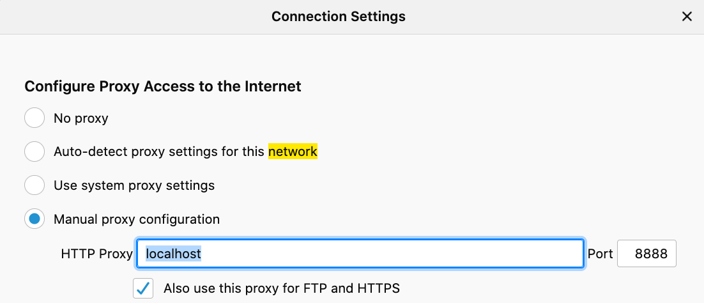

# openconnect-tinyproxy

This container runs `tinyproxy` in the background before starting `openconnect`. This allows you to point a browser at the proxy in order to reach VPN only sites while leaving the rest of your computer's network unshackled.

## Why

You are checking out this project because the VPN you have to use is full-tunnel: _ALL_ of your computer's traffic is sent over it. This is pretty terrible:

1. Privacy issues: All your traffic is being monitored and logged.
1. Bandwidth issues: At the best of times your speed will likely be far less than your local connection. At the worst (peak hours) things can be unusably slow.
1. Latency issues: The VPN endpoint is on the east coast. If you're coming from the west coast that means adding an additional ~90ms of latency to many of your requests (or even more due to VPN congestion).

## Build

Docker will need to be running.

You need to build the container at least once:

```bash
./build
```

## Run

To run the container for the CMS project:

```bash
./run-cms
```

To run the container for the eApp project:

```bash
./run-eapp
```

You'll be prompted to enter your credentials. This is your username, password, and the second password is the OTP code for VPN access. If you did things right, you will see an open connection and a message along the lines of “You are accessing a U.S. Government information system”.
## Configuration
 For best performance, run a second browser pointed at the proxy so your primary browser is free.

### To use in Firefox

Create a [new browser profile](https://developer.mozilla.org/en-US/docs/Mozilla/Firefox/Multiple_profiles) for CMS and configure its network settings to use an HTTP proxy pointing at `localhost:8888`.

Here's an example of how to configure Firefox (General > Network Settings):



Or instead, consider using FoxyProxy [extension](https://addons.mozilla.org/en-US/firefox/addon/foxyproxy-standard/)

### To use in Chrome 
Consider using [FoxyProxy](https://chrome.google.com/webstore/detail/foxyproxy-standard/gcknhkkoolaabfmlnjonogaaifnjlfnp?hl=en).

## Development

Before pushing changes, please setup `pre-commit`:

```bash
brew install pre-commit
pre-commit install --install-hooks
```
